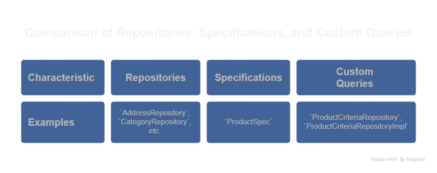

<div id="top">

<!-- HEADER STYLE: CLASSIC -->
<div align="center">


# SPRING-BOOT-FUNDAMENTALS

<!-- BADGES -->


</div>
<br>

---

## Overview

`spring-boot-fundamentals` is **my personal learning project** for mastering the essentials of Spring Boot.  
This project was built as part of my Spring Boot learning journey, following along with an online course.
I developed the code step by step alongside the lessons to reinforce core concepts and gain hands-on experience with real-world examples.

### Why this project exists

This repo helped me explore Spring Boot fundamentals by providing:

- 🗄️ **Practical Data Model Practice**  
  A simple e-commerce–style schema for experimenting with JPA/Hibernate mappings and relationships.

- ⚡ **Lightweight Service Layer Examples**  
  Notification, order-processing, and payment sample services to understand dependency injection and business-logic separation.

- 🔍 **Flexible Querying Techniques**  
  Custom repositories, Criteria API, and Specification patterns for dynamic filtering and search.

- ⚙️ **Configuration Playground**  
  Profiles, YAML vs. properties, and environment variables to see how Spring handles configuration.

> **Note:** Everything here is for educational purposes only— **not** production-ready.


---

## Getting Started

### Prerequisites

This project requires the following dependencies:

- **Programming Language:** Java
- **Package Manager:** Maven


### What is maven?
- **Type:** Build Tool (Project Management Tool)
- **Purpose:** Managing project builds, dependencies, and lifecycles.
- **Description:** Maven is a powerful tool used to automate the build process of Java-based applications, including Spring Boot projects. It uses a **pom.xml** file to define project dependencies, plugins, and configurations. With Maven, you can easily compile code, run tests, package your application into JARs or WARs, and manage versioned libraries from remote repositories.

- **In Spring Boot:** Maven simplifies setting up and managing Spring Boot applications by automatically resolving required dependencies like Spring Web, Spring Data JPA, and Spring Security.

```xml
<dependency> 
   <groupId>org.springframework.boot</groupId>
   <artifactId>spring-boot-starter</artifactId> 
   <version>3.5.0</version>
</dependency>
``` 
### Project Structure Overview
<h3 align="center">📁 Project Structure Overview</h3>

<p align="center">
  
</p>

<p align="center">
  
</p>

<p align="center">
  
</p>

### Installation

Build Spring-boot-fundamentals from the source and install dependencies:

1. **Clone the repository:**

    ```sh
    ❯ git clone https://github.com/Gwozdz1uuu/Spring-boot-fundamentals
    ```

2. **Navigate to the project directory:**

    ```sh
    ❯ cd Spring-boot-fundamentals
    ```

3. **Install the dependencies:**

**Using [maven](https://maven.apache.org/):**

```sh
❯ mvn install
```
